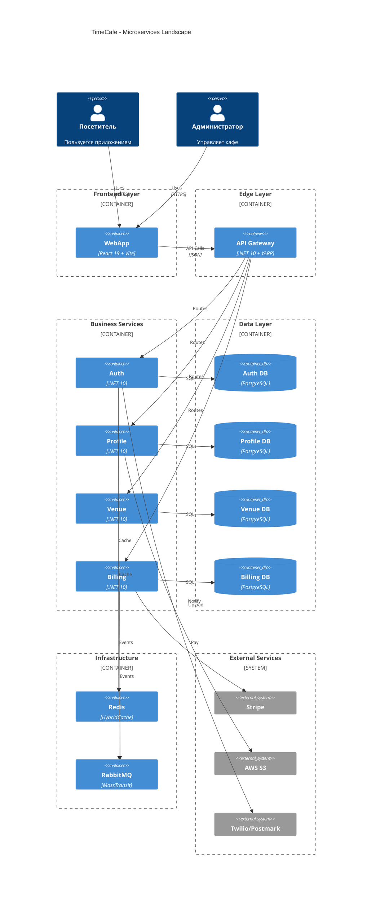
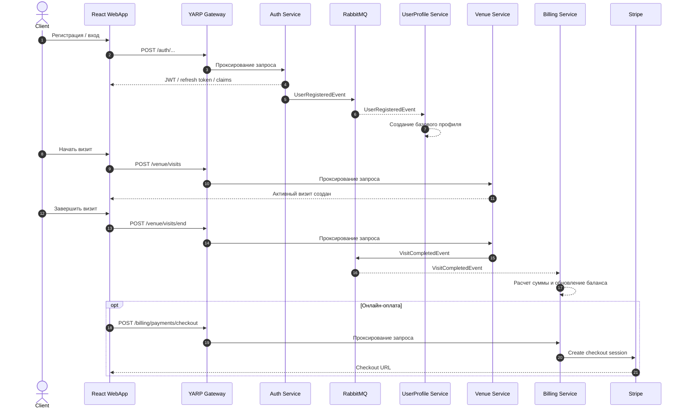

# TimeCafe


TimeCafe это микросервисная платформа для автоматизации тайм-кафе. Проект создавался как практическая, близкая к production система, где нужно не просто хранить CRUD-данные, а связать регистрацию пользователей, профили, визиты, тарифы, акции, биллинг, кэширование, события и наблюдаемость в один согласованный контур.

Основная идея проекта: каждый сервис отвечает за свою bounded context-область, хранит свои данные отдельно, общается через события и остается достаточно автономным, чтобы его можно было развивать независимо.

## Зачем этот проект

TimeCafe решает типичный набор задач для домена тайм-кафе:

- регистрация и аутентификация пользователей;
- управление ролями и разрешениями;
- хранение и модерация профилей;
- работа с тарифами, темами, акциями и визитами;
- расчет стоимости посещений и учет баланса;
- единая точка входа через gateway;
- централизованная документация API, health-checks и логирование.

Это не демонстрационный монолит, а учебно-прикладная архитектура с реальными инфраструктурными зависимостями: PostgreSQL, Redis, RabbitMQ, Elasticsearch, Kibana, S3 и Stripe.

## Диаграммы


### C4 Container



### Ключевой сценарий



## Сервисы

| Сервис | Порт | Gateway route | Назначение |
| --- | --- | --- | --- |
| Auth | 8001 | /auth | Аутентификация, JWT, Identity, RBAC, OAuth, email и SMS-сценарии |
| UserProfile | 8002 | /userprofile | Профили пользователей, фото в S3, дополнительная информация, кэширование |
| Venue | 8003 | /venue | Тарифы, темы, акции, активные и завершенные визиты |
| Billing | 8004 | /billing | Баланс, транзакции, Stripe checkout и webhook |
| YarpProxy | 8010 | / | Единая точка входа, reverse proxy, агрегированная документация Scalar |

## Технологический стек

### Backend

- .NET 10
- ASP.NET Core Minimal API
- Carter
- MediatR + CQRS
- FluentValidation
- FluentResults
- EF Core 10 + Npgsql
- ASP.NET Identity + JWT Bearer
- YARP Reverse Proxy
- MassTransit + RabbitMQ
- HybridCache + Redis
- Scalar OpenAPI
- Serilog + Elasticsearch + Kibana

### Frontend

- React 19
- TypeScript
- Vite
- Redux Toolkit + react-redux + redux-persist
- Fluent UI v9
- Tailwind CSS v4
- Vitest
- Playwright

### Инфраструктура и интеграции

- PostgreSQL 16
- Redis 8.4
- RabbitMQ 4.2
- Elasticsearch 9.2 + Kibana 9.2
- Docker Compose
- Stripe
- Twilio
- Postmark
- S3-compatible storage
- Google OAuth
- Microsoft OAuth
- Google reCAPTCHA
- Sightengine

## Практики и паттерны

В проекте сознательно используются не просто библиотеки, а устойчивые архитектурные практики:

- отдельная БД на каждый сервис;
- Clean Architecture по слоям API -> Application -> Domain -> Infrastructure;
- CQRS с handler-ами в Application-слое;
- result pattern через FluentResults с маппингом в HTTP-ответы;
- централизованная валидация через FluentValidation и pipeline behaviors;
- event-driven интеграция через MassTransit и RabbitMQ;
- HybridCache + Redis для hot-path чтений и инвалидации по тегам;
- policy-based authorization и permissions-based RBAC;
- Options pattern с валидацией конфигурации на старте;
- OpenAPI через Scalar вместо классического Swagger UI;
- health checks и observability из коробки;
- интеграционные и unit-тесты с xUnit, Moq, FluentAssertions и Testcontainers.

## Структура репозитория

```text
Services/
	Auth/
	UserProfile/
	Venue/
	Billing/
	YarpProxy/
	BuildingBlocks/

WebApp/
	timecafe.react.ui/

scripts/
docs/
docker-compose.yml
Directory.Packages.props
appsettings.shared.json
```

## Локальный запуск

### Что нужно заранее

- Docker Desktop
- .NET SDK 10
- Node.js 20+
- npm 10+

### 1. Подготовить переменные окружения

Создайте локальный файл окружения на основе шаблона:

```bash
copy .env.example .env
```

### 2. Поднять инфраструктуру

```bash
docker compose up -d postgres redis rabbitmq elasticsearch kibana
```

### 3. Поднять backend-контур

```bash
docker compose up -d --build auth-service profile-service venue-service billing-service yarp-proxy
```

Если нужен полный запуск одним действием:

```bash
docker compose up -d --build
```

### 4. Запустить frontend в dev-режиме

```bash
cd WebApp/timecafe.react.ui
npm install
npm run dev -- --host
```

## Что открыть после старта

- API gateway и общая документация: http://localhost:8010/scalar/v1
- Frontend dev server: http://localhost:5173
- RabbitMQ management: http://localhost:15672
- Kibana: http://localhost:5601

## Конфигурация

Ключевые настройки хранятся в следующих местах:

- [appsettings.shared.json](appsettings.shared.json) для общих параметров;
- appsettings.json и appsettings.Development.json внутри каждого сервиса;
- [.env](.env) и [docker-compose.yml](docker-compose.yml) для контейнеризированного запуска.

На практике чаще всего нужно заполнить:

- JWT issuer, audience и signing key;
- строки подключения PostgreSQL, Redis и RabbitMQ;
- OAuth credentials для Google и Microsoft;
- Postmark и Twilio;
- S3 и Sightengine;
- Stripe keys и webhook secret;
- Serilog / Elasticsearch endpoints.

## Тестирование

Для точечных прогонов лучше запускать отдельные тестовые проекты или наборы сценариев, а не все решение целиком.

Примеры:

```bash
dotnet test Services/Auth/Auth.TimeCafe.Test/Auth.TimeCafe.Test.csproj --settings .runsettings
dotnet test Services/Venue/Venue.TimeCafe.Test/Venue.TimeCafe.Test.csproj --settings .runsettings
```

Для frontend:

```bash
cd WebApp/timecafe.react.ui
npm run test:run
```

## Что важно в этой архитектуре

Сильная сторона TimeCafe не в количестве сервисов как таковом, а в том, что доменная логика, инфраструктура и интеграции разведены достаточно четко:

- gateway не знает бизнес-логику, а только маршрутизирует и упрощает вход;
- сервисы не делят общую БД;
- межсервисные связи уходят в события, а не в жесткие синхронные зависимости;
- чтения ускоряются кэшем, но источник истины остается в PostgreSQL;
- документация, health checks и логирование встроены в базовый контур, а не добавлены постфактум.

Именно это делает проект хорошей базой и для pet-практики, и для дальнейшего развития в сторону production-ready платформы.
