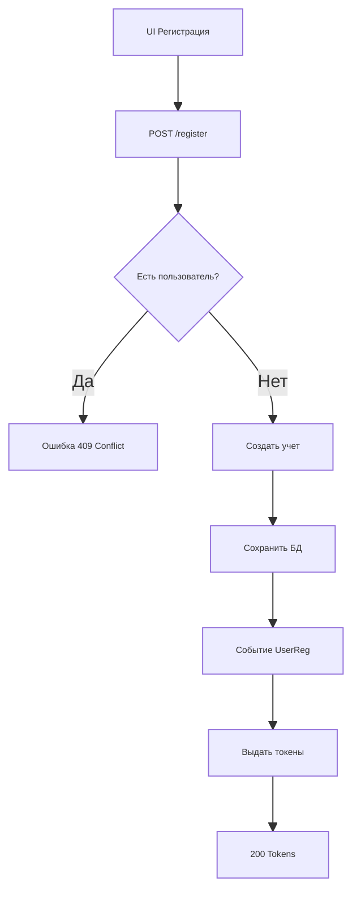
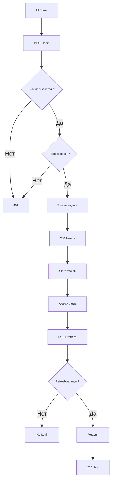
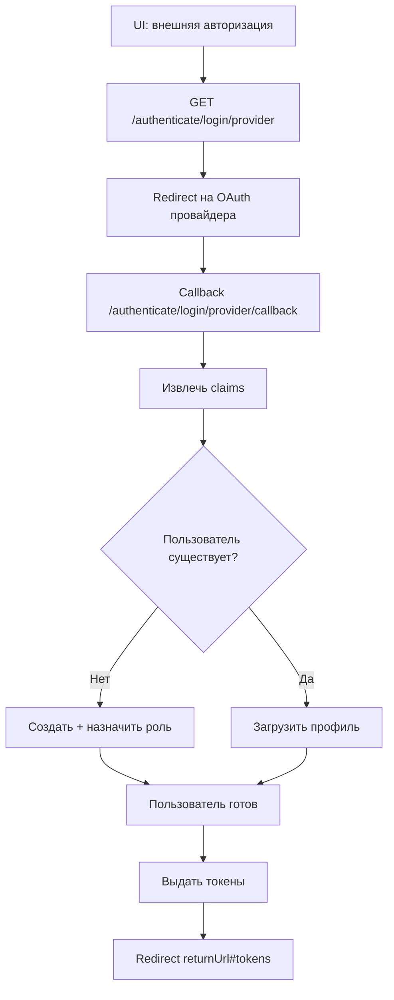

# Auth Module — Блок-схемы (Mermaid)

Ниже представлены основные блок-схемы (flow diagrams) для ключевых процессов модуля авторизации. Они дополняют `sequence-auth.md`, фокусируясь на логике принятия решений и шагах обработки.

## 1. Регистрация пользователя (`POST /registerWithUsername`)



### Ключевые моменты

- Проверка уникальности (email/username)
- Создание через ASP.NET Identity
- Публикация события для других сервисов
- Выдача пары токенов (access + refresh)

> Ошибка при повторной регистрации: всегда 409 Conflict (дубликат).

## 2. Логин и обновление токенов (`POST /login-jwt`, `POST /refresh-token-jwt`)



### Ключевые проверки

- Существование пользователя
- Валидация пароля
- Проверка refresh токена (просрочен / отозван)
- Ротация refresh токена при успешном обновлении
  > Ограничение: Mermaid не умеет фиксировать одинаковую ширину прямоугольников. Добиться визуального равенства можно только подбором длины текста и шрифта. Для строгой одинаковой ширины используйте PlantUML.

Альтернатива (PlantUML для логина):

```plantuml
@startuml
skinparam DefaultFontName Arial
skinparam RectangleFontSize 8
rectangle "UI Логин" as A
rectangle "POST /login" as B
rectangle "Есть пользователь?" as C
A --> B --> C
rectangle "Пароль верен?" as D
C --> D
rectangle "401" as Z
C --> Z
D --> Z
rectangle "Токены выдать" as E
D --> E
rectangle "200 Tokens" as F
E --> F
@enduml
```

## 3. Внешняя OAuth авторизация (Google / Microsoft)



### Особенности

- Использование внешнего claim (email, provider key)
- Идемпотентное создание пользователя (FindOrCreate)
- Возврат через hash/фрагмент для SPA
