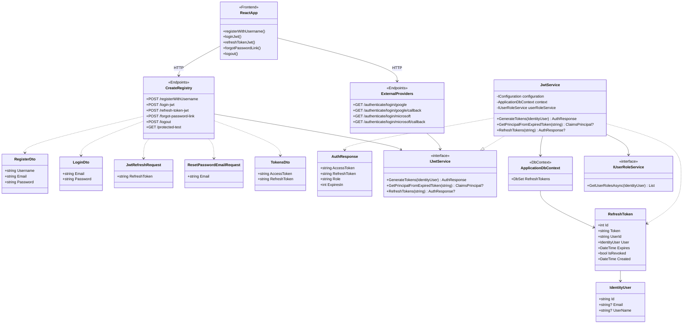

```mermaid
classDiagram
    %% === Frontend Layer ===
    class ReactApp {
        <<Frontend>>
        +registerWithUsername()
        +loginJwt()
        +refreshTokenJwt()
        +forgotPasswordLink()
        +logout()
    }

    %% === Minimal API Endpoints (Carter Modules) ===
    class CreateRegistry {
        <<Endpoints>>
        +POST /registerWithUsername
        +POST /login-jwt
        +POST /refresh-token-jwt
        +POST /forgot-password-link
        +POST /logout
        +GET /protected-test
    }
    class ExternalProviders {
        <<Endpoints>>
        +GET /authenticate/login/google
        +GET /authenticate/login/google/callback
        +GET /authenticate/login/microsoft
        +GET /authenticate/login/microsoft/callback
    }

    %% === Application Layer DTOs ===
    class RegisterDto {
        +string Username
        +string Email
        +string Password
    }
    class LoginDto {
        +string Email
        +string Password
    }
    class JwtRefreshRequest {
        +string RefreshToken
    }
    class ResetPasswordEmailRequest {
        +string Email
    }
    class TokensDto {
        +string AccessToken
        +string RefreshToken
    }
    class AuthResponse {
        +string AccessToken
        +string RefreshToken
        +string Role
        +int ExpiresIn
    }

    %% === Infrastructure Services ===
    class IJwtService {
        <<interface>>
        +GenerateTokens(IdentityUser) AuthResponse
        +GetPrincipalFromExpiredToken(string) ClaimsPrincipal?
        +RefreshTokens(string) AuthResponse?
    }
    class JwtService {
        -IConfiguration configuration
        -ApplicationDbContext context
        -IUserRoleService userRoleService
        +GenerateTokens(IdentityUser) AuthResponse
        +GetPrincipalFromExpiredToken(string) ClaimsPrincipal?
        +RefreshTokens(string) AuthResponse?
    }

    %% === Data / Persistence ===
    class ApplicationDbContext {
        <<DbContext>>
        +DbSet<RefreshToken> RefreshTokens
    }
    class RefreshToken {
        +int Id
        +string Token
        +string UserId
        +IdentityUser User
        +DateTime Expires
        +bool IsRevoked
        +DateTime Created
    }

    %% === External / Identity Types (simplified) ===
    class IdentityUser {
        +string Id
        +string? Email
        +string? UserName
    }
    class IUserRoleService {
        <<interface>>
        +GetUserRolesAsync(IdentityUser) List<string>
    }

    %% === Relationships (упрощённо) ===
    ReactApp --> CreateRegistry : HTTP
    ReactApp --> ExternalProviders : HTTP
    CreateRegistry --> IJwtService
    ExternalProviders --> IJwtService
    JwtService ..|> IJwtService
    JwtService --> ApplicationDbContext
    JwtService --> IUserRoleService
    ApplicationDbContext --> RefreshToken
    RefreshToken --> IdentityUser
    CreateRegistry ..> RegisterDto
    CreateRegistry ..> LoginDto
    CreateRegistry ..> JwtRefreshRequest
    CreateRegistry ..> ResetPasswordEmailRequest
    CreateRegistry ..> TokensDto
    JwtService ..> AuthResponse
    JwtService ..> RefreshToken
```
