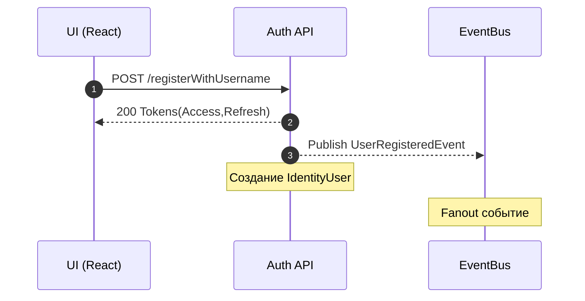
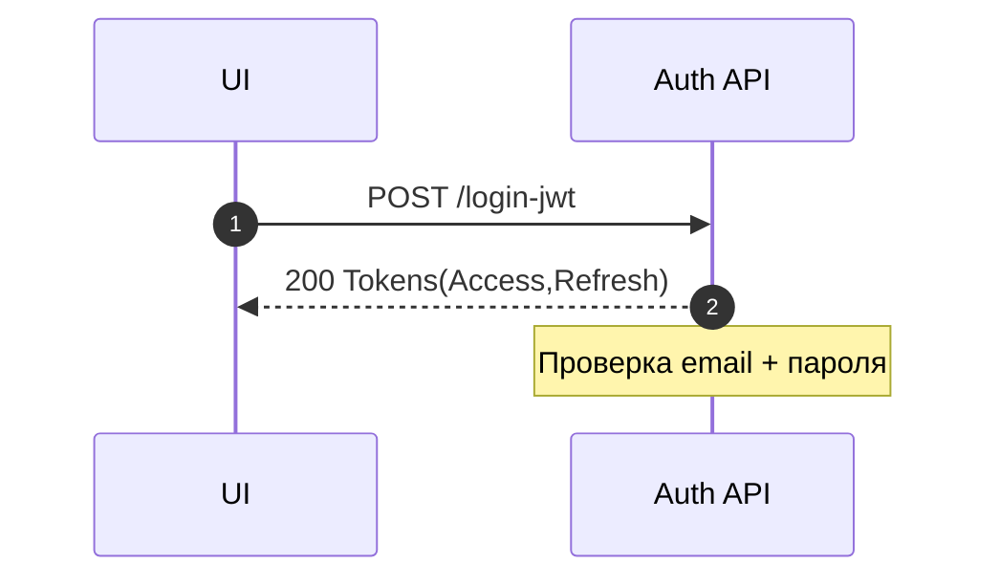
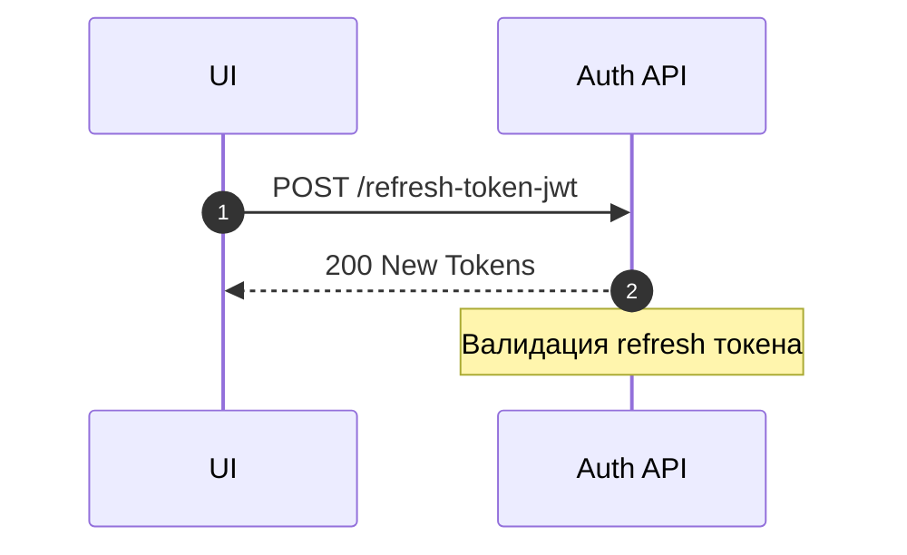
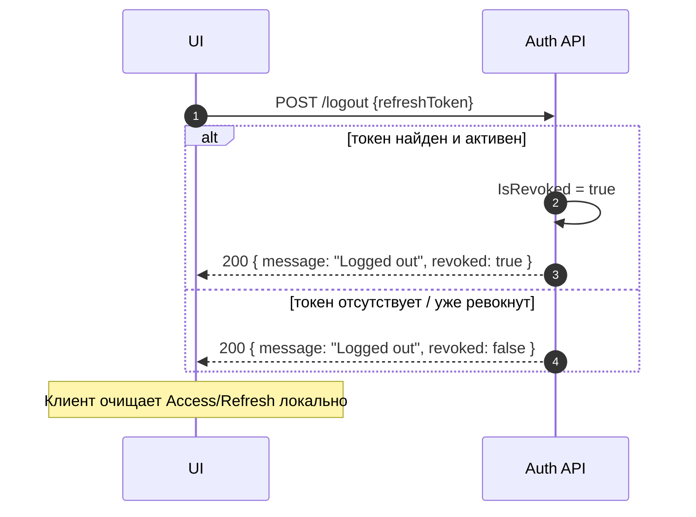
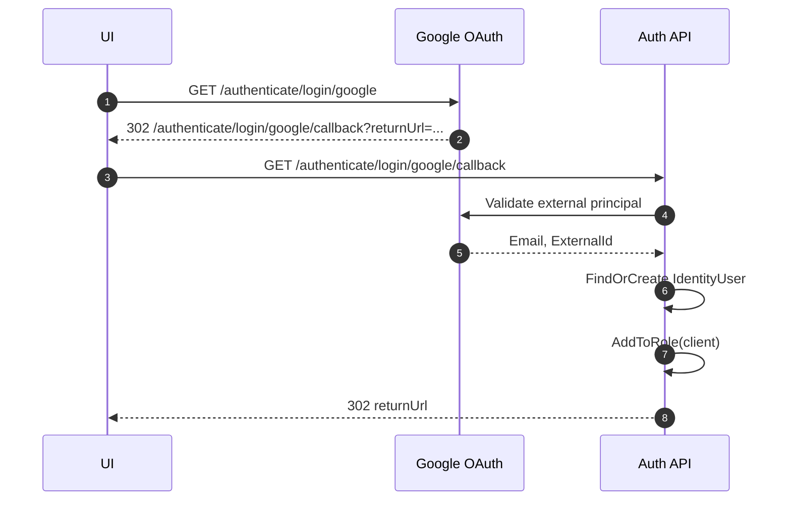
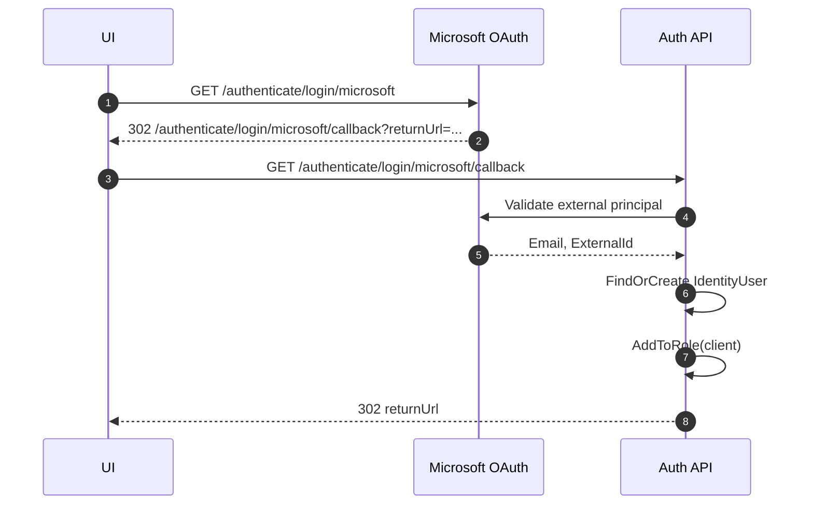
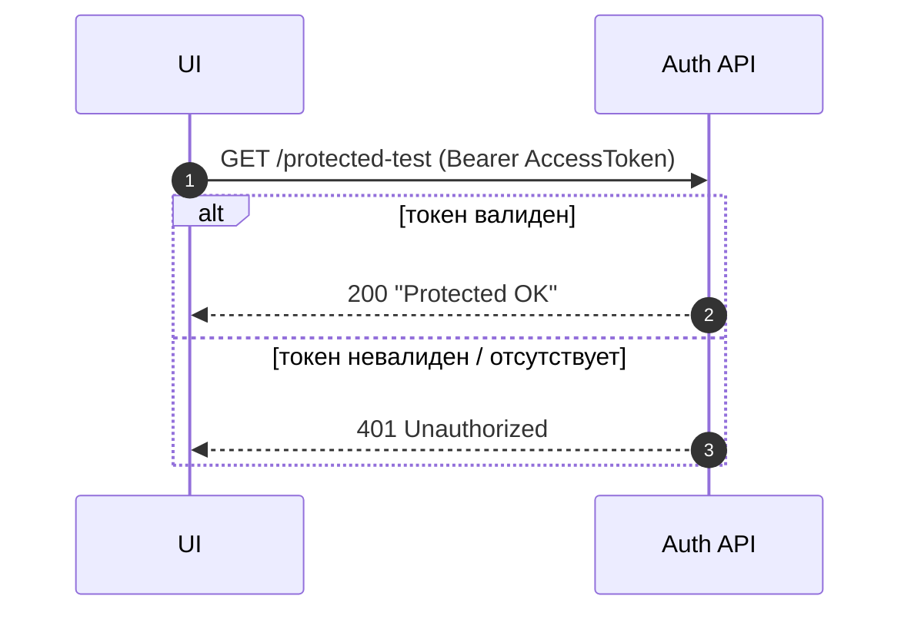

# Сценарии аутентификации (Mermaid)

Файл разбит на отдельные диаграммы вместо большого блока с `par`. Оставлены только фактически реализованные эндпоинты из `Auth.TimeCafe.API`:

- `POST /registerWithUsername`
- `POST /login-jwt`
- `POST /refresh-token-jwt`
- `POST /forgot-password-link`
- Внешние провайдеры: `GET /authenticate/login/{google|microsoft}` и их `.../callback`

Не включены: вымышленные `/auth/logout`, `/admin/users/block`, произвольные `/data/*` — таких маршрутов нет в текущем коде. Роли выдаются внутренне через `AddToRoleAsync`, отдельного сервиса ролей нет, поэтому участник `RoleSvc` удалён. Email отправка в reset пароле закомментирована — показываем её как опциональную.

## Регистрация пользователя



## Логин и получение токенов



## Обновление токена (Refresh Flow)



## Сброс пароля (Forgot Password)

```mermaid
sequenceDiagram
autonumber
participant UI as UI
participant Auth as Auth API
participant (Mail) as Email? optional
UI->>Auth: POST /forgot-password-link
Auth-->>UI: 200 {callbackUrl}
Auth-->>(Mail): (опционально) Send reset link
note over Auth: Генерация reset token + Base64Url
```

## Logout (Выход пользователя)



## Внешняя авторизация (Google пример)



## Внешняя авторизация (Microsoft пример)



## Защищённый ресурс (пример теста)



> Если появятся новые эндпоинты (logout, блокировка пользователей и т.п.), их можно оформить дополнительными диаграммами ниже.

### Возможные дальнейшие улучшения

- Добавить диаграмму для сценария публикации событий (детализация брокера).
- Отдельно показать поток смены пароля (если добавится реальная отправка Email).
- Добавить секцию ошибок: неверный пароль, просроченный refresh.

При необходимости могу создать PlantUML версии для каждого блока в отдельном файле (`sequence-google.puml`, и т.д.). Напишите, если нужно.
